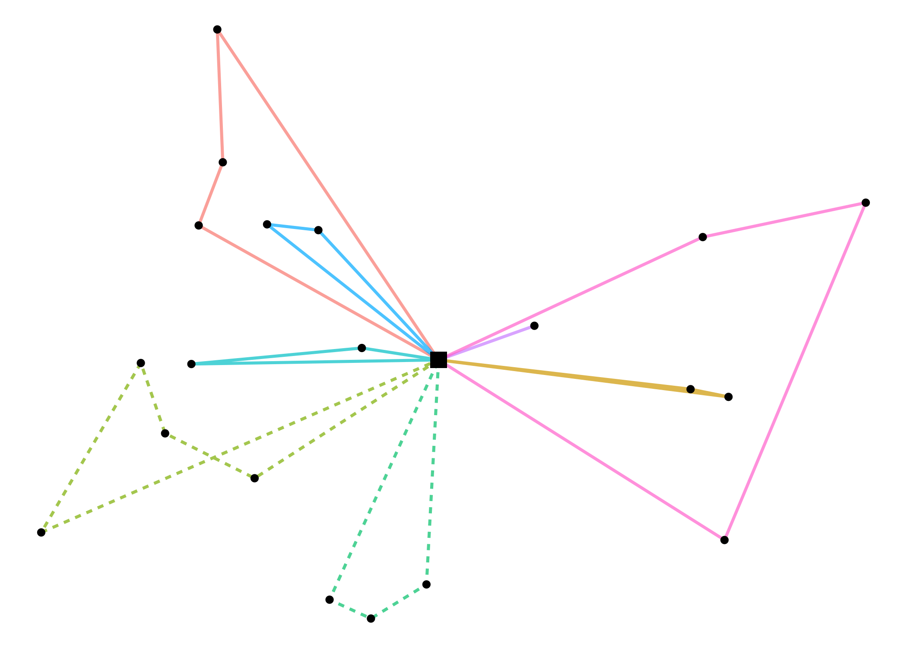
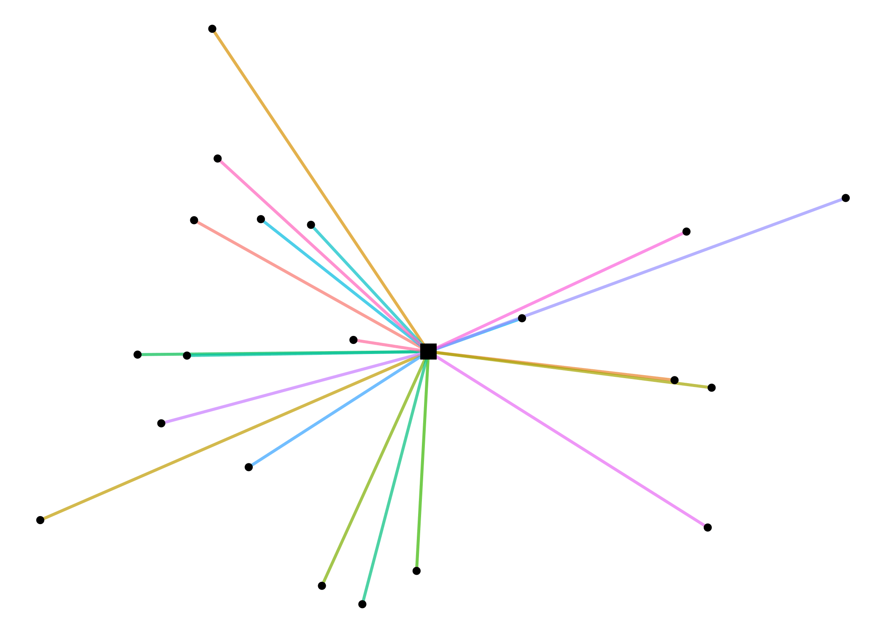
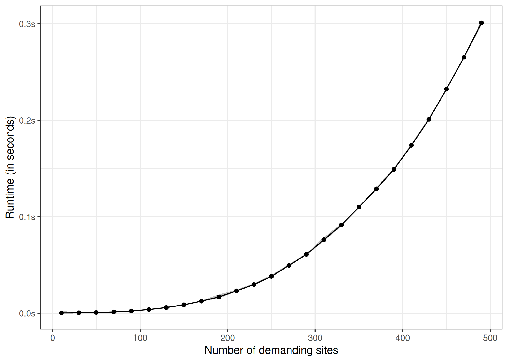

<!-- README.md is generated from README.Rmd. Please edit that file -->

# heumilkr

<!-- badges: start -->

[](https://github.com/lschneiderbauer/heumilkr/actions/workflows/R-CMD-check.yaml)
[](https://app.codecov.io/gh/lschneiderbauer/heumilkr?branch=master)
[](https://lifecycle.r-lib.org/articles/stages.html#experimental)
[](https://CRAN.R-project.org/package=heumilkr)

<!-- badges: end -->

This R package provides an implementation of the Clarke-Wright algorithm
([Clarke and Wright 1964](#ref-clarke1964)) to find a quasi-optimal
solution to the [Capacitated Vehicle Routing
Problem](https://en.wikipedia.org/wiki/Vehicle_routing_problem).

## Installation

You can install the latest CRAN release of heumilkr with:

``` r
install.packages("heumilkr")
```

Alternatively, you can install the development version of heumilkr from
[GitHub](https://github.com/) with:

``` r
# install.packages("devtools")
devtools::install_github("lschneiderbauer/heumilkr")
```

## Example

The following example generates random demands at random locations,
defines two vehicle types, applies the Clarke-Wright algorithm to
generate quasi-optimal vehicle runs, and shows the resulting vehicle run
solution.

``` r
library(heumilkr)
set.seed(42)

# generating random demand
demand <- runif(20, 5, 15)

# generating random site positions
positions <-
  data.frame(
    pos_x = c(0, runif(length(demand), -10, 10)),
    pos_y = c(0, runif(length(demand), -10, 10))
  )

solution <-
  clarke_wright(
    demand,
    dist(positions),
    # We have an infinite number of vehicles with capacity 33 available,
    # and two vehicles with capacity 44.
    data.frame(n = c(NA_integer_, 2L), caps = c(33, 44))
  )

print(solution)
#> $runs
#>   run vehicle max_load  distance
#> 1   0       0 31.75943 29.029139
#> 2   1       0 25.78821 16.929475
#> 3   2       1 41.60558 32.192404
#> 4   3       1 34.12677 20.601801
#> 5   4       0 22.65398 14.329082
#> 6   5       0 21.76854 14.231704
#> 7   6       0 14.34672  6.043174
#> 8   7       0 30.58007 36.895550
#> 
#> $sites
#>    site    demand
#> 1     0 14.148060
#> 2     1 14.370754
#> 3     2  7.861395
#> 4     3 13.304476
#> 5     4 11.417455
#> 6     5 10.190959
#> 7     6 12.365883
#> 8     7  6.346666
#> 9     8 11.569923
#> 10    9 12.050648
#> 11   10  9.577418
#> 12   11 12.191123
#> 13   12 14.346722
#> 14   13  7.554288
#> 15   14  9.622928
#> 16   15 14.400145
#> 17   16 14.782264
#> 18   17  6.174874
#> 19   18  9.749971
#> 20   19 10.603327
#> 
#> $visits
#>    run site order      load
#> 1    0    0     0 17.611366
#> 2    1    1     0 11.417455
#> 3    0    2     2  0.000000
#> 4    2    3     3  0.000000
#> 5    1    4     1  0.000000
#> 6    3    5     2  0.000000
#> 7    3    6     0 21.760882
#> 8    2    7     2 13.304476
#> 9    3    8     1 10.190959
#> 10   4    9     1  0.000000
#> 11   5   10     0 12.191123
#> 12   5   11     1  0.000000
#> 13   6   12     0  0.000000
#> 14   2   13     0 34.051287
#> 15   7   14     1 14.782264
#> 16   2   15     1 19.651142
#> 17   7   16     2  0.000000
#> 18   7   17     0 24.405193
#> 19   0   18     1  7.861395
#> 20   4   19     0 12.050648

# returns the total cost / distance
# (the quantity that is minimized by CVRP)
print(milkr_cost(solution))
#> [1] 170.2523

# returns the savings resulting from the heuristic optimization procedure
print(milkr_saving(solution))
#> [1] 166.7192
```

A plotting function (using [ggplot](https://ggplot2.tidyverse.org/)) for
the result is built in. The individual runs are distinguished by color.
The demanding site locations are marked with round circles while the
(single) supplying site is depicted as a square. The line types
(solid/dashed/…) are associated to different vehicle types.

``` r
plot(solution)
```



The following animation shows how the Clarke-Wright algorithm iterates
to arrive at its final solution:



## Runtime Benchmarks

The benchmarks were taken on an Intel® Xeon® CPU E3-1231 v3 @ 3.40GHz
CPU, using the R package [bench](https://bench.r-lib.org/).

The following graph shows the run time behavior as the number of sites
$n$ increase. The curve exhibits near-cubic behavior in $n$. For
$n = 110$ the performance is still relatively reasonable with a run time
of $\sim 3.87ms$.



<div id="refs" class="references csl-bib-body hanging-indent"
entry-spacing="0">

<div id="ref-clarke1964" class="csl-entry">

Clarke, G., and J. W. Wright. 1964. “Scheduling of Vehicles from a
Central Depot to a Number of Delivery Points.” *Operations Research* 12
(4): 568–81. <https://doi.org/10.1287/opre.12.4.568>.

</div>

</div>
