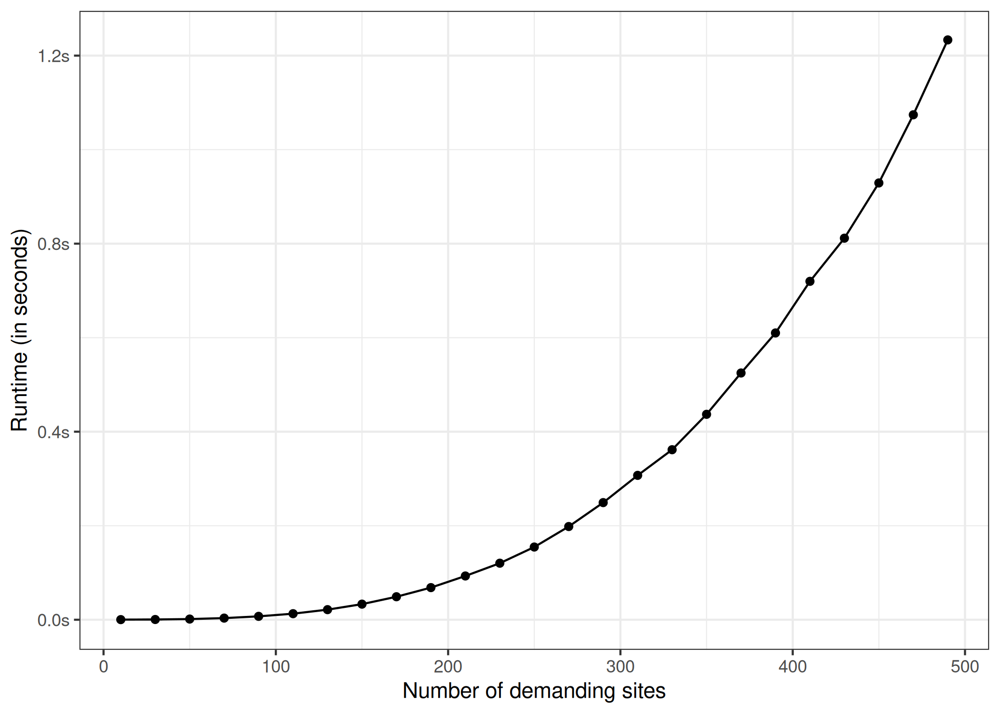

<!-- README.md is generated from README.Rmd. Please edit that file -->

# heumilkr

<!-- badges: start -->

[](https://github.com/lschneiderbauer/heumilkr/actions/workflows/R-CMD-check.yaml)
[](https://app.codecov.io/gh/lschneiderbauer/heumilkr?branch=master)
[](https://lifecycle.r-lib.org/articles/stages.html#experimental)
[](https://CRAN.R-project.org/package=heumilkr)

<!-- badges: end -->

This R package provides an implementation of the Clarke-Wright algorithm
([Clarke and Wright 1964](#ref-clarke1964)) to find a quasi-optimal
solution to the [Capacitated Vehicle Routing
Problem](https://en.wikipedia.org/wiki/Vehicle_routing_problem).

## Installation

You can install the latest CRAN release of heumilkr with:

``` r
install.packages("heumilkr")
```

Alternatively, you can install the development version of heumilkr from
[GitHub](https://github.com/) with:

``` r
# install.packages("devtools")
devtools::install_github("lschneiderbauer/heumilkr")
```

## Example

The following example generates random demands at random locations,
defines two vehicle types, applies the Clarke-Wright algorithm to
generate quasi-optimal vehicle runs, and shows the resulting vehicle run
solution.

``` r
library(heumilkr)
set.seed(42)

# generating random demand
demand <- runif(20, 5, 15)

# generating random site positions
positions <-
  data.frame(
    pos_x = c(0, runif(length(demand), -10, 10)),
    pos_y = c(0, runif(length(demand), -10, 10))
  )

solution <-
  clarke_wright(
    demand,
    dist(positions),
    # We have an infinite number of vehicles with capacity 33 available,
    # and two vehicles with capacity 44.
    data.frame(n = c(NA_integer_, 2L), caps = c(33, 44))
  )

print(solution)
#>    site run order vehicle     load  distance
#> 1     0   0     0       0 31.75943 29.029139
#> 2     1   1     0       0 25.78821 16.929475
#> 3     2   0     2       0 31.75943 29.029139
#> 4     3   2     3       1 41.60558 32.192404
#> 5     4   1     1       0 25.78821 16.929475
#> 6     5   3     2       1 34.12677 20.601801
#> 7     6   3     0       1 34.12677 20.601801
#> 8     7   2     2       1 41.60558 32.192404
#> 9     8   3     1       1 34.12677 20.601801
#> 10    9   4     1       0 22.65398 14.329082
#> 11   10   5     0       0 21.76854 14.231704
#> 12   11   5     1       0 21.76854 14.231704
#> 13   12   6     0       0 14.34672  6.043174
#> 14   13   2     0       1 41.60558 32.192404
#> 15   14   7     1       0 30.58007 36.895550
#> 16   15   2     1       1 41.60558 32.192404
#> 17   16   7     2       0 30.58007 36.895550
#> 18   17   7     0       0 30.58007 36.895550
#> 19   18   0     1       0 31.75943 29.029139
#> 20   19   4     0       0 22.65398 14.329082

# returns the total cost / distance
# (the quantity that is minimized by CVRP)
print(milkr_cost(solution))
#> [1] 170.2523

# returns the savings resulting from the heuristic optimization procedure
print(milkr_saving(solution))
#> [1] 166.7192
```

A plotting function (using [ggplot](https://ggplot2.tidyverse.org/)) for
the result is built in. The individual runs are distinguished by color.
The demanding site locations are marked with round circles while the
(single) supplying site is depicted as a square. The line types
(solid/dashed/…) are associated to different vehicle types.

``` r
plot(solution)
```


## Benchmarks

The benchmarks were taken on an Intel® Xeon® CPU E3-1231 v3 @ 3.40GHz
CPU, using the R package [bench](https://bench.r-lib.org/).

The following graph shows the run time behavior as the number of sites
$n$ increase. The curve exhibits near-cubic behavior in $n$. For
$n = 110$ the performance is still relatively reasonable with a run time
of $\sim 12.9ms$.



<div id="refs" class="references csl-bib-body hanging-indent">

<div id="ref-clarke1964" class="csl-entry">

Clarke, G., and J. W. Wright. 1964. “Scheduling of Vehicles from a
Central Depot to a Number of Delivery Points.” *Operations Research* 12
(4): 568–81. <https://doi.org/10.1287/opre.12.4.568>.

</div>

</div>
