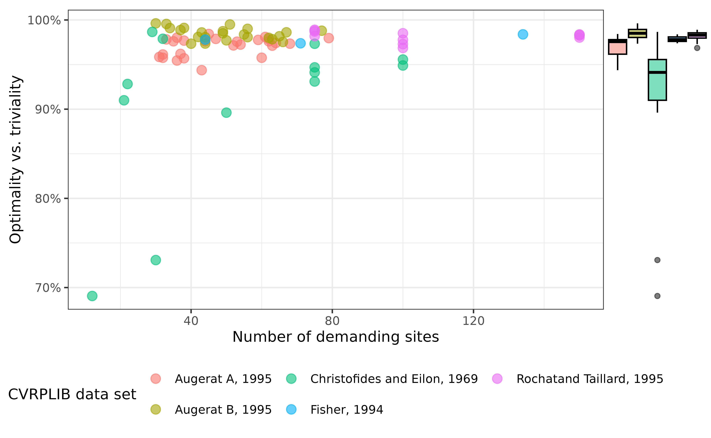
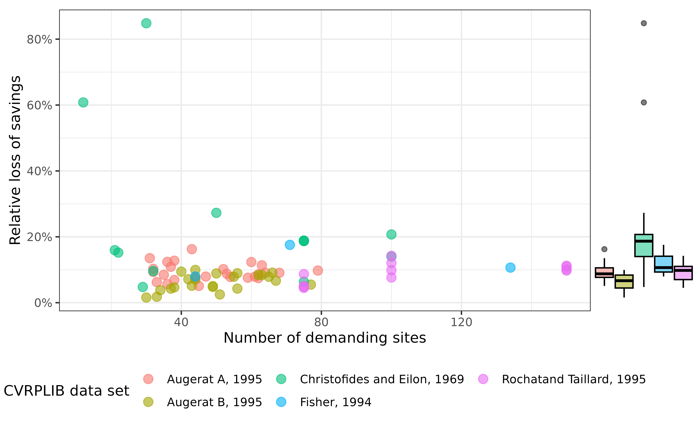

# Clarke Wright Performance Benchmarks

In this vignette we discuss performance benchmarks of the Clarke-Wright
algorithm implemented in this package by comparing the Clarke-Wright
solutions of a set of problem instances with their optimal value.

### The problem instance data

The problem instances we are basing our measurements on are provided
courtesy of [CVRPLIB](http://vrp.atd-lab.inf.puc-rio.br/) and can be
divided into five groups[¹](#fn1) of different characteristics:

- Augerat A, 1995 (27 instances)

- Augerat B, 1995 (23 instances)

- Christofides and Eilon, 1969 (13 instances)

- Fisher, 1994 (3 instances)

- Rochat and Taillard, 1995 (12 instances)

The data provides the problem instance as well as the optimal solution.

## Relation to optimal and trivial solution

The idea of this indicator is to measure where the Clarke-Wright
solution sits in between the optimal solution and the trivial
solution[²](#fn2). Let $\gamma$ be the cost of the Clarke-Wright
solution, $\omega$ the cost of the optimal solution, and $\alpha$ the
cost of the trivial solution. The measure $\xi$ is defined to be
$$\xi:=1 - \frac{\gamma - \omega}{\alpha - \omega}\,.$$ The measure can
move between zero and 1. It is zero if the solution is the trivial
solution, and it is one if the solution is the optimal solution.

Evaluating this for CVRPLIB sample data yields the following graph.

The mean value over all problem instances is $\overline{\xi} = 96.7\%$.

## Relative deviation of optimal solution

We can also simply measure the relative deviation of the Clarke-Wright
cost to the optimal cost, $$\rho:=\frac{\gamma - \omega}{\gamma}\,,$$
which measures how much savings we miss by using the Clarke-Wright
solution instead of the optimal solution.

The mean value over all problem instances is $\overline{\rho} = 11\%$,
i.e. on average, we miss out on around $11\%$ savings taking the
Clarke-Wright solution compared to the optimal one.

------------------------------------------------------------------------

1.  The naming is directly taken from
    [CVRPLIB](http://vrp.atd-lab.inf.puc-rio.br/)

2.  By trivial solution we mean the solution where each site is assigned
    exactly one route (which goes back and forth).
